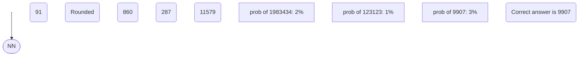

# Deep Dive into LLMs

## Resources
- [Deep Dive into LLMs like ChatGPT](https://www.youtube.com/watch?v=7xTGNNLPyMI&list=WL)

## Introduction

### pretaining data (internet)

TLDR; the data is collected from the internet, then using a complex pipeline the data gets pruned and formatted.

e.g. [FineWeb](https://www.youtube.com/redirect?event=video_description&redir_token=QUFFLUhqbnRWa3hWRDZxXzlpYURVekxZdlZibnloQ1RFUXxBQ3Jtc0trMWJzaXl5cmRqYlAwVXhVOHBIS2dRLWUzUkFQQUphY0VQNF9hVHd1RGl5RjI4NmZjdkc5NV8xc21wM0c5V1dZdnBGX3h0Zzk0M1FySEJVdFBUSnJQZUN1NW1zWGY5TDJoRm9IUDcwYm9VSTJfYm41NA&q=https%3A%2F%2Fhuggingface.co%2Fspaces%2FHuggingFaceFW%2Fblogpost-fineweb-v1&v=7xTGNNLPyMI)
1. Url Filtering (no porn, no illegal content)
2. Text Extraction (not html, not js, just text)
3. Language Filtering (only english or other languages)
4. Gopher Filtering (quality of the text using different metrics. e.g. word count, sentence count, etc.)
5. MinHash dedup
6. C4 Filters
7. Custom Filters
8. PII Removal

### tokenization

TLDR; finding patterns in the text and converting them into tokens.
The goal is to maximize the representation of the text with the least tokens possible

1. Text to UTF-8 encode to get raw bites (8 bites per character) (a -> 01100001)
2. Change the bites to integers (0-255) (a -> 97)
3. Byte pair encoding; Find consecutive characters that appear together and replace them with a single token.
(e.g. "116 32" -> "32")
_GPT 4 uses ~100k symbols_

"hello world -> 2 tokens (hello, world) (15339, 1917)"
"Hello world -> 2 tokens (hello, world) (9907, 1917)"
"helloworld -> 2 tokens (h, elloworld) (71, 96392)"

Explore examples in [Tiktokenizer](https://tiktokenizer.vercel.app/)

### neuronal network I/O

TLDR; We take windows of token in the dataset _we control the window size e.g. 512 tokens_ and we predict the next token.
**This is the input to the neuronal network. The output is the probability of the next token.**

### training

Because we already know the next token in the training data, we can calibrate the neuronal network to predict the next token with a high probability.

### Neuronal network internals
We have the inputs of tokens that can go to 0 to a defined amount of tokens.
This is the context, then we have put this inputs with parameters (_weights_) which are like knobs that

All of this is passed to a gian mathematical expression that will always give the outputs.

### Inference
generating new datea from the model, to analize what kind of patterns the model has internalized.

The use case of this is to generate text _or predict the next token_ inspired by the data that the model has seen.

