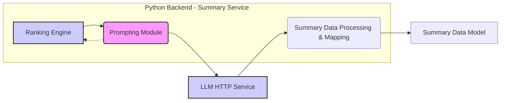
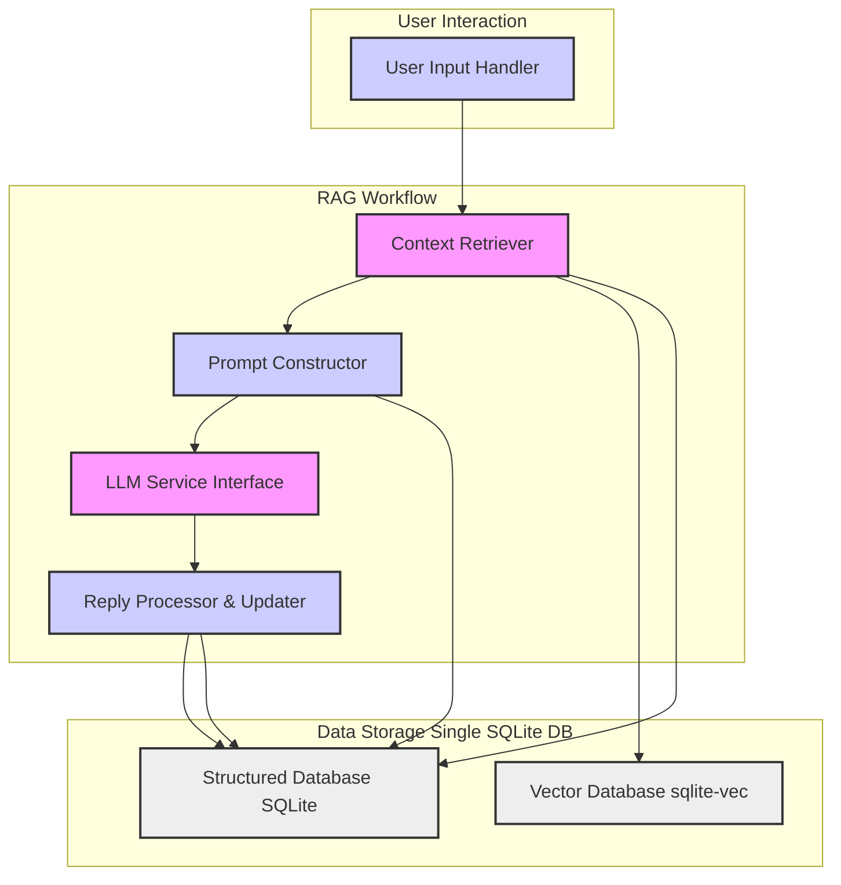
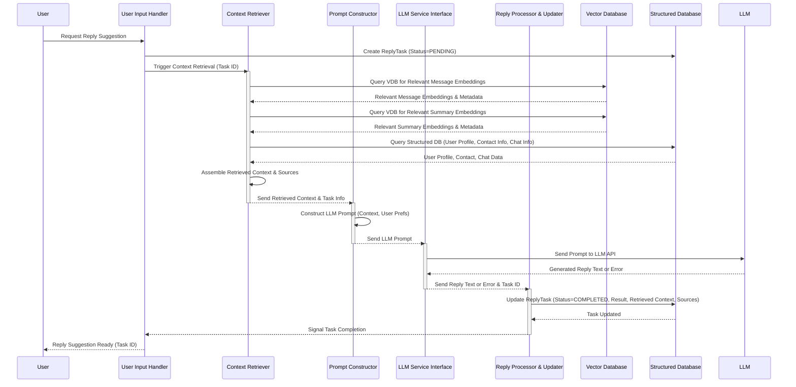

# Python POC Technical Design Document TDD

##Problem Statement

This project aims to build a personal assistant for managing WhatsApp messages. It will summarize daily messages, track important conversations, provide reply reminders, and offer AI-powered reply suggestions, all while prioritizing user privacy by keeping data and LLM processing local.

This project will be used as a portfolio & personal software.

**Problems to Solve**:
1. **Message Management**: Efficiently summarize and track relevant WhatsApp messages.
2. **Reply Reminders**: Implement reminders for important messages or pending responses.
3. **AI Assistance**: Use a local Language Model (LLM) to generate reply suggestions.
4. **Data Privacy**: Ensure all data processing and AI computations are done locally to protect user privacy.

This project serves as a learning opportunity for Python, AWS infrastructure, modern Python tooling, and local LLM exploration.
Furthermore exposes a Design driven project.

## Summary
For further understanding of the explored **Workflows** of the system, pleaser read the [python-poc.spec.md](https://github.com/eduardosanzb/eduardosanzb/blob/master/notes/python-poc.spec.md)

**Key Components**

- **Backend**: FastAPI application for handling API requests, querying the database, triggering message summarization, managing conversation importance and reminders, and interacting with a local LLM.
- **Database**: PostgreSQL for storing chat messages and metadata locally.
- **Integration**:
  - WhatsApp: Use web-whatsapp.js to extract chat logs and send them to the backend.
  - Telegram: Utilize the Python Telegram Bot library for bot interactions.
  - Local LLM: Integrate llama.cpp for message summaries and reply suggestions.


## Resources

-   [Transitioning from JavaScript to Python](https://medium.com/@JeffyJeff/transitioning-from-javascript-to-python-bridging-the-scripting-divide-7a78f9e76752)
-   [Python Telegram Bot Library](https://python-telegram-bot.readthedocs.io/en/latest/)
-   [FastAPI Documentation](https://fastapi.tiangolo.com/)
-   [PostgreSQL Documentation](https://www.postgresql.org/docs/)
-   [llama.cpp](https://github.com/ggerganov/llama.cpp) (Example Local LLM)

## Goals

* Improve efficiency in managing WhatsApp messages.
* Reduce the burden of responding to messages.
* Enhance message context and prioritization.
* Provide a private and secure solution.
* Provide a learning platform for Python, AWS, and LLM technologies.


## Technology Stack
* Python
* FastAPI
* PostgreSQL
* Telegram Bot API
* Local LLM (e.g., llama.cpp)
* AWS (Elastic Beanstalk/ECS, RDS)

## Deployment
* The system shall be deployable to AWS using CI/CD pipelines.
* Deployment scripts shall be provided for local development and production environments.

## Testing
* Unit tests shall be implemented for core logic.
* E2E tests shall be implemented to verify end-to-end functionality.
* API testing shall be implemented to verify API endpoints.

## Future Considerations
* Integration with other messaging platforms.
* Advanced LLM fine-tuning on personal writing style.
* Web-based user interface for advanced features.
* Automated chat export from Whatsapp.

### Out of Scope
-   Direct WhatsApp integration (due to API limitations). We'll rely on exporting chat history.
-   Building a complex web UI initially.  We'll start with a Telegram interface.
-   Fine-tuning the LLM on personal writing style (stretch goal).
-   Monorepo (for now, keep it simple).
-   Manage Reminders or User Preferences

## Exploration
For further understanding of the explored **Workflows** of the system, pleaser read the [python-poc.spec.md](https://github.com/eduardosanzb/eduardosanzb/blob/master/notes/python-poc.spec.md)
We can divide the exploration in the next blocks
1.  **Data Acquisition**
2.  **Core Backend**
3.  **Client Interface**

### Data Acquisition
We need to implement a mechanism to parse exported WhatsApp chat logs and POST them to the backend for storing and post-processing.

In this block, we have to split in the next challenges:
1. How to retrieve the messages, by using an export or by using a scraping method.
2. Mechanism to get the latest messages. A simple approach would be to have a "tick" process that is constantly checking for new messages.
3. How to send the data to the backend.

For point 1 & 2 probably we could think of 2 approaches:
A) Import all the messages once and then listen to new updates.
B) Have a script that runs as a tick which will process all the messages everytime.
Lets explore PROS/CONS of both of this ones

#### Approach A
This approach would require an initial data migration to be run. And to keep a server running all the time.

On the *positive* side, this would be the leanest approach and it could result in a "realtime" experience.

On the *negative* side it would be very prone to edge cases such as:
- Missing messages when the service is down
- Mechanism to validate all messages have been processed.
- Situations with multiple messages at the same time; could create a very chatty system

The initial migration could be done using the export conversation; nevertheless cannot export ALL conversations  AT ONCE; and we'd need to automate the clicking of doing this.

An example of the export file:
```text
[26.11.24, 12:32:35] Eduardo Sanchez: What’s the name of the restaurant that have multiple kitchens on Neukölln a
[26.11.24, 12:32:43] Eduardo Sanchez: We went there always with Bcg
[26.11.24, 12:34:06] Eduardo Sanchez: Paolo pinker!
[26.11.24, 12:49:53] Emre Bcg Personal: Ouff lamb chops and cocktails
[26.11.24, 12:50:03] Emre Bcg Personal: Having a company party ?
```

Furthermore we'll need to find a similar project as [Baileys](https://github.com/WhiskeySockets/Baileys) which impelements a websocket listener to whatsapp. _we could use this but then we are not using python_

Another idea is to rely on a stream platform such as apache kafka; but come one. Overkilling it.

#### Approach B
This approach could result in a more deterministic results. Because we'd run a script that fetches all the chats and attempt to discover unread messages.

In the *positive*:
- A more deterministic approach; given that we'd ensure all the chats have been processed.
- In the long run a lower resource approach; we can run this "tick" every n minutes on cron-basis.
- We can also attempt to optimize delta changes based on previous runs.

In the *negative*:
- We'd need to implement a mechanism to diff the already processed; tho we could also just leave this to the DB with some unique-indexes
- The processing of the chats could become a problem if we have a very big chat history
- We could encounter locking problems; in the case the processing gets too slow .

##### Open-Questions
- How to handle slow runs or avoid overlapping runners?
**There could be the situation that we schedule to run the script while an older one is still running. The main problem here is that we could be wasting resources.**

**To Solve this, we can have a very simple "lockin" mechanism using the backend api. Simple and noncomplicated. Because we'll not have a distrubuted system or any kind of concurrency**

- How to detect change detection?
**When looking at the Interface provided by `whatsapp-web.js` we can see they offer an `unreadCount` and `lastMessage`. We could use this values to infer a) if there are new messages b) when was the last message*

- Error handling?
**Given that we are going to run the sync in a cron-basis we can just create a reporting mechanism and throw it to the slack or something monitoring like**

- Security? # TODO
**Given that we only care to send data to our backend; we can ensure the container can only reach the ip for our backend. using dnsmasq from within our container.
In this way we do not have to have a more complex network setup and we can run our script in CI runners or cron jobs anywhere**


- Authentication session for wwweb
**We'll use the [Remote auth strategy](https://wwebjs.dev/guide/creating-your-bot/authentication.html#remoteauth-strategy) to store the sessions in the backend db.

Here is a POC:

```sh
#!/bin/bash

# Get the IP address of eduardosanzb.dev and set up iptables rules
EDUARDOSANZB_IP=$(dig +short eduardosanzb.dev | head -n 1)
echo "Eduardo's IP: $EDUARDOSANZB_IP"

# Set up iptables rules
iptables -A OUTPUT -d "$EDUARDOSANZB_IP" -p tcp --dport 443 -j ACCEPT
iptables -A OUTPUT -p tcp --dport 443 -j DROP

# Curl to the allowed domain
echo "Curling to https://eduardosanzb.dev"
curl -sSf https://eduardosanzb.dev>/dev/null  && echo "Success!"

# Curl to the blocked domain
echo "Curling to https://google.com (should fail)"
curl -v -m 10 --connect-timeout 5 -sSf https://google.com && echo "Success!" || echo "Failed as expected!"

echo "finish"
```

```dockerfile
FROM alpine:latest

RUN apk add --no-cache curl iptables bind-tools dnsmasq

# Add the custom DNS configuration for dnsmasq
RUN echo "server=/eduardosanzb.dev/8.8.8.8" > /etc/dnsmasq.conf && \
    echo "address=/#/0.0.0.0" >> /etc/dnsmasq.conf

WORKDIR /
COPY ./test_curl.sh /test_curl.sh
RUN chmod +x /test_curl.sh

# Starting this bad boi
RUN dnsmasq

## The script will attempt to curl google and fail
CMD ["sh", "test_curl.sh"]
```


#### Recomendation
It seems that the approach B is a more maintanable and straightforward one. The only benefit we have with Approach A is the "realtime" experience which is not that important for us.

Tho we could leverage having some kind of message queue; this would entail having more moving parts; for now we'll keep the complexity low.

In the negative the approach A open the door for too many edge cases.

Regarding the implementation details; we could automate this by using a Selenium driver and automate it with python. Nevertheless we found a very good [javascript](https://wwebjs.dev/) implementation and it would feel super wrong to not use it. Furthermore we'll have other opportunities to practice python through this project.

We have to keep an eye on the processing time and to make sure if we should implement some kind of deferance or queue.

In summary:
**We are going to create a script that will get the messages from whatsapp using web-whatsapp.js. This script will be running in a cron basis. Firstly the script will check if there's another running script _(asking the backend `/lock`)_ and later on `POST`ing the chats/messages to the backend**

**As initial; we'll run the script on schedule using github actions scheduled jobs**


###  Backend
["hexagonal" diagram](https://excalidraw.com/#json=Oo-ud0PtztQG4T4s4eqQc,XbTi-8yYntL_K9Oh6EB70g)
The requirements for a backend are the next:
* [x] CRUD chats/messages
  * [x] Standarize & store
  * [x] Vectorize data
* [x] Triggering message summarization.
* [x] Managing conversation importance and reminders.
* [x] Actions
  * [x] Send Summary periodically
  * [x] Send reminders
  * [x] Automatic reply
  * [x] Custom reply
  * [x] Create cal event
  * [x] Ignore

The backend ensures all data processing and AI computations are done locally, prioritizing user privacy.

We can split this exploration in the next parts:
- [ ] Data Layer
    - [x] Data ingestion/exposure
  - [x] Data model
      - [x] Define interfaces (OAS, Types, etc)
      - [ ] Ranking rules
    - [ ] Data Storage
      - [x] DB setup
      - [x] Migrations
      - [x] Client
      - [ ] Vector data research
- [ ] Summary engine
  - [] Data model of a summary
  - [ ] LLm integration research
  - [ ] Testing Business Logic
- [ ] Actions (send/receive)
  - [ ] Integrations capabilities (which integrations)
    - [x] interact with whatsapp
    - [ ] Connect googlecal
    - [ ] interact with chat bot (telegaram or slack tbd)
    - [ ] interact with email
  - [ ] Define CRUD interfaces for actions
  - [ ] Reminders engine
The common component between this parts is that we'll be coupling all of this functionality in one monolithic service. As a learning opportunity we'll use python instead of typescript or go.

#### Data Layer
This section is the foundation of the core backend; one of the main decisions we have to make here is to select the database technology; As constraints we have that this is a small project; so we want to prioritize simplicity nevertheless we also want to use the right tool.

##### The Database Technology
We first explore the rationale behind choosing a SQL database engine. SQL databases are well-established and offer robust features for structured data management, relational integrity, and efficient querying – all critical for our application's data requirements.
Without any doubt we can recommend to use a SQL database engine.

Subsequently to this decision in the exploration; we have to explore the database technology to use; the biggest contenders are PostgreSQL recognized for its enterpise-grade capabilities and the rich ecosystem such as `pgvector` or `supabase`; On the other-hand we have SQLite which stands out as simple, embedded nature and file-base, making it super lightweight and easy to deploy, the ecosystem is not as extensive but we found nice vector plugins such as [`sqlite-vec`](https://alexgarcia.xyz/sqlite-vec/).
Considering the nature of the project and rapid development, our **recommendation for this section is to start with SQLite, architecture the data layer in a way that we can gradually if required migrate towards PostgreSQL**

#### Migrations
In our exploration of database migration management tools, we considered several popular open-source options including [Flyway](https://flywaydb.org/), [Liquibase](https://www.liquibase.org/), [dbmate](https://github.com/amacneil/dbmate) and [Atlas](https://atlasgo.io/). While each tool offers robust capabilities, Atlas stands out due to its modern, declarative approach to schema management, aligning well with infrastructure-as-code principles.

Atlas's language-agnostic nature, defining schemas in HCL or SQL and generating standard SQL migrations, ensures broad applicability regardless of the application's backend language.
Its workflow promotes standardized, version-controlled database evolution, crucial for maintainability and collaboration. Furthermore, Atlas is designed for seamless integration with CI/CD pipelines, automating schema updates as part of the development lifecycle.

**Our recommendation for this section is to adopt Atlas as our database migration management tool due to its modern declarative approach, language agnosticism, CI-friendly workflow, and potential for Terraform integration.**

We tested atlas by managing a simple schema with changes and applying the migrations, with the next workflow:


- Make changes to the `schema.hcl` file
- Run the command to generate the SQL migration file
`atlas migrate diff --dev-url "sqlite://dev?mode=memory" --to "file://schema.hcl"`
- To apply the migration
`atlas migrate status --env local`

#### Conceptual Data Model (core entities)

We started by identifying the core entities needed for our personal chat application: `UserProfile`, `Contacts`, `Chats`, and `Messages`.
We recognized the need to store user preferences and decided to create a separate `SummaryPreferences` entity to manage settings related to chat summarization, keeping it distinct from the general `UserProfile`.
Throughout our discussion, we prioritized pragmatism and aimed for a balance between creating a solid foundation and avoiding over-engineering for the initial version

We refined our entities by considering the features of `whatsapp-web.js` and incorporating more specific message types and relevant properties to align with real-world chat data.
Key decisions included separating "critical contacts" as a property of the Contacts entity itself for broader usability and keeping keyword preferences within `SummaryPreferences` for content control during summarization.

**1. UserProfile**
*   **Purpose:** Represents the user of the personal software application itself. Stores the main user's profile information and general application preferences.
*   **Attributes:**
    *   `user_profile_id` (INTEGER, PRIMARY KEY, Auto-increment): Unique identifier for the user profile.
    *   `name` (TEXT, NOT NULL): User's display name.
    *   `email` (TEXT, Optional): User's email address.
    *   `preferred_language` (TEXT, Optional, default 'en'): User's preferred language for the application interface.
    *   `theme` (TEXT, Optional, default 'system'): Preferred application theme (e.g., 'light', 'dark', 'system').
    *   `timezone` (TEXT, Optional, default 'UTC'): User's timezone for displaying times and reminders.

**2. SummaryPreferences**
*   **Purpose:** Stores user-specific preferences related to chat summarization and reminder features. Linked one-to-one with `UserProfile`.
*   **Attributes:**
    *   `summary_preferences_id` (INTEGER, PRIMARY KEY, Auto-increment): Unique identifier for these preferences.
    *   `user_profile_id` (INTEGER, NOT NULL, UNIQUE, FOREIGN KEY referencing `UserProfile`): Foreign key linking to the associated `UserProfile`.
    *   `summary_frequency` (TEXT, NOT NULL, default 'daily', values: 'daily', 'weekly', 'scheduled', 'manual', 'off'): How often summaries are generated.
    *   `daily_summary_time` (TEXT, Optional, default '09:00'): Time of day for daily summaries (HH:MM format).
    *   `weekly_summary_day` (TEXT, Optional, default 'Monday', values: 'Monday', 'Tuesday', ..., 'Sunday'): Day of the week for weekly summaries.
    *   `scheduled_summary_times` (TEXT, Optional): JSON array of scheduled summary times (HH:MM strings).
    *   `summarize_chat_types` (TEXT, NOT NULL, default 'all', values: 'all', 'group_chats_only', 'one_to_one_chats_only'): Types of chats to include in summaries.
    *   `keywords_enabled` (BOOLEAN, NOT NULL, default FALSE): Enable keyword-based summarization.
    *   `keywords_list` (TEXT, Optional): JSON array of keywords for summarization.

**3. Contacts**
*   **Purpose:** Stores metadata about individuals with whom the user has chat conversations.
*   **Attributes:**
    *   `contact_id` (INTEGER, PRIMARY KEY, Auto-increment): Unique identifier for the contact in our application.
    *   `name` (TEXT, NOT NULL): The name the user uses for this contact.
    *   `phone_number` (TEXT, Optional): Contact's phone number.
    *   `email_address` (TEXT, Optional): Contact's email address.
    *   `chat_app_username` (TEXT, Optional): Contact's username on a chat application.
    *   `is_critical` (BOOLEAN, NOT NULL, default FALSE): Flag to mark if the contact is considered "critical".
    *   `contact_language` (TEXT, Optional, default NULL): Contact's preferred language for communication.

**4. Chats**
*   **Purpose:** Represents individual chat conversations within the application.
*   **Attributes:**
    *   `chat_id` (INTEGER, PRIMARY KEY, Auto-increment): Unique identifier for the chat conversation.
    *   `chat_type` (TEXT, NOT NULL, default 'one_to_one', values: 'one_to_one', 'group'): Type of chat conversation (1-on-1 or group).
    *   `chat_name` (TEXT, Optional): Name of the chat (especially for group chats).
    *   `chat_language` (TEXT, Optional, default NULL, values: 'en', 'de', 'es', 'auto'): The language of the conversation.
    *   `creation_date` (TEXT, Optional): Date and time when the chat was created.
    *   `last_message_date` (TEXT, Optional): Date and time of the last message in the chat.
    *   `has_unread_messages` (BOOLEAN, NOT NULL, default FALSE): Flag indicating if there are unread messages in the chat.

**5. Messages**
*   **Purpose:** Stores individual messages within chat conversations.
*   **Attributes:**
    *   `message_id` (INTEGER, PRIMARY KEY, Auto-increment): Unique identifier for the message.
    *   `chat_id` (INTEGER, NOT NULL, FOREIGN KEY referencing `Chats`): Foreign key linking to the `Chats` table, indicating which chat the message belongs to.
    *   `sender_type` (TEXT, NOT NULL, default 'contact', values: 'user_profile', 'contact'): Type of sender (either the main `UserProfile` or a `Contact`).
    *   `sender_id` (INTEGER, NOT NULL): ID of the sender (references either `user_profiles` or `contacts` based on `sender_type`).
    *   `sent_date` (TEXT, NOT NULL): Date and time when the message was sent.
    *   `message_type` (TEXT, NOT NULL, default 'text', values: 'text', 'image', 'video', 'audio', 'document', 'location', 'contact_card', 'sticker', 'system', 'other'): Type of message content.
    *   `text_content` (TEXT, Optional): Text content of the message (for text-based messages).
    *   `media_url` (TEXT, Optional): URL to media attachment (for media messages).
    *   `is_deleted` (BOOLEAN, NOT NULL, default FALSE): Flag indicating if the message has been marked as deleted.
    *   `is_forwarded` (BOOLEAN, NOT NULL, default FALSE): Flag indicating if the message is a forwarded message.
    *   `has_media` (BOOLEAN, NOT NULL, default FALSE): Flag indicating if the message has media attached.
    *   `message_embedding` (BLOB, Optional): Vector embedding of the message text content.

#### Interfaces and API design
In this section we'll explore how all the components of our system will interact with each other.
- REST API - The core backbone of our integration; allows for the cron-job & Chatbot to interact with the system
- DB Client - The interaction between our Backend and the DB
- Typescript SDK - A wrapper around the REST API to facilitate the interactions.

##### API Design foundations

Throughout this document we'll be exploring discovering the required specifications for our API; and later on we'll be using our [Design API checklist](./api-design-rfc.checklist.md) to ensure we are following the best practices.


As now we can already start by defining the main API endpoints; We can categorize the domains for our API in the next ones, based in our [workflows](./python-poc.spec.md)

1. Message Sourcing and Processing `/messages`
`POST` `/messages`- Send WhatsApp messages to the backend for processing.

2. Message Summarization `/summarization`
`POST` `/summarization/start` - Trigger message summarization.
`GET` `/summarization/status` - Check summarization status.
`GET` `/summarization/result` - Retrieve summarization results.

3. User Requests for AI-Powered Replies
`POST /replies/generate` - Request AI-generated reply suggestion for a specific message.
`POST /replies/approve` - Approve the generated reply for sending.
`POST /replies/update-reply` - Update the reply with user addendums.

4. Custom Reply Proxy `/replies/custom`
`POST` `/replies/custom` - Proxy a custom reply to a specific conversation.

5. System Health and Status `/system/status`
`GET` `/system/status `- Retrieve system health and status.

~6. Reminder Management~ Out of scope

From this we can generate our FastAPI types, which eventually will be used to create OAS and TS definitions.

##### DB Client
Given that we'll use sqlite; we can use the library already provided by [python](https://docs.python.org/3/library/sqlite3.html).
With this simple approach and combining it with FastAPI pydanctic models we can have a very simple and straightforward approach.

#### Ranking Logic
This section outline how conversations are prioritized in the summary creation of our system.
This is crucial for determining which conversations are more important, need urgent attention or shoul dbe highlighted by the chatbot.

We can break down this section in the next parts:
- **Ranking Criteria** - What's the criteria to determine the priority of a conversation.
- **Ranking Algorithm** - How the ranking is calculated based on the criteria.
- **Implementation and Testing** - How the ranking logic is implemented and tested in the system.


1. **Ranking Criteria**
- **Sender Priority**: Messages from high-priority contacts are ranked higher.
- **Critical Keywords**: Messages containing predefined critical keywords (e.g., "urgent," "deadline") are prioritized.
- **Recency*: More recent messages are given higher priority to ensure timely responses.
- **User Interaction**: Messages interacted with by the user (replied, favorited) are ranked higher.
- **Message Context and Sentiment*: Sentiment analysis influences ranking, with negative sentiment indicating potential issues.

2. **Ranking Algorithm**
Weighted Scoring System: Each criterion is assigned a weight, contributing to a total score for each message:
Example:
```python
def calculate_priority(message):
    # Example calculation using sender priority, keyword presence, and recency
    sender_priority = get_sender_priority(message.sender)
    has_critical_keyword = any(keyword in message.content for keyword in get_critical_keywords())
    recency_score = calculate_recency_score(message.timestamp)
    return sender_priority * 0.4 + has_critical_keyword * 0.3 + recency_score * 0.3
```

Dynamic Weights: Users can adjust weights to customize prioritization.

3. **Implementation and Testing**

- Data Model Enhancements:
    - Expand the Contacts entity with an enumeration for priority levels.
    - Rename keywords_list in SummaryPreferences to critical_keywords.
    - Add fields to track user interactions (replied, favorited).
- Integrate sentiment scores from the local LLM.
- Implement the weighted scoring system in the message ranking logic.
- Write unit tests to validate the ranking algorithm with various scenarios.

**Key Decisions**

1. _Granularity of Ranking_
Decision: Implement message-level ranking initially for simplicity.
Rationale: Allows highlighting critical messages without waiting for conversation aggregation.

2. _Hybrid Approach_
Plan: Consider evolving to a hybrid model combining both message and conversation ranking in the future.
    Primary ranking by conversation for coherence.
    Secondary ranking of individual messages within conversations.

**Exploration Process**
1. Initial Focus: Started with defining ranking criteria, ensuring alignment with functional requirements and user needs.
2. Algorithm Selection: Chose a weighted scoring system due to its simplicity and effectiveness.
3. Granularity Discussion: Debated message vs. conversation ranking, opting for an initial message-level approach with future scalability.


#### Summary Engine
The summary engine is one of the core functionalities of our system, responsible for generating concise summaries of chat messages. This section explores the API design, data model of a summary, the summarization techniques.
Later in this section we'll explore the AI-powered integration within the engine.

##### API Design deep-dive

Initially, we considered a synchronous API with a single endpoint (`/summarization/start`) that would return the summary once the process was complete. However, this approach has significant drawbacks for longer summarization tasks, as it can block the client and provide no feedback on progress.

We then explored an asynchronous approach, implementing three endpoints: `/summarization/start` to trigger the summarization, `/summarization/status` to check the progress, and `/summarization/result` to retrieve the summary once completed. This design allows for a non-blocking, scalable solution where users can initiate summarization and check back later without waiting for the process to finish.

To accommodate scenarios where users might have multiple summarization requests, we included the ability to check the status and retrieve results for one or more summary IDs via the status and result endpoints. This design requires a mechanism to store and track summarization requests, statuses, and results.

**We recommend implementing the asynchronous API** with the following endpoints:

*   `POST /summarization/start`: Initiates the summarization process and returns a `summary_id` for tracking. Required parameters include `chat_id` to specify which chat to summarize with the optional params of `start_timestamp` and `end_timestamp`
    to filter which messages summarize..
*   `GET /summarization/status`: Checks the status of a summarization request using `summary_id` or an array of `summary_ids` Optional parameter is a list of ID. Returns fields like status, start time, completion time & progress percentage.
*   `GET /summarization/result`: Retrieves the summary result using `summary_id` an array of `summary_ids` Optional parameter is a list of ID. Returns the complete formatted & structured summary.

##### Shape of a Summary

The shape of the summary was designed with the user interface and workflows in mind. We went through several iterations, exploring options that ranged from simple lists of key points to complex structures with various metadata. To provide the most value, we determined that the summary should provide actionable insights for the user.

Based on the workflows described in [`python-poc.spec.md`](./python-poc.spec.md), The main action is AI autogenerated rely and the whatssapp Proxy functionality; the design converges to provide insight of the most important converations and from there trigger any action needed.

We decided to structure the summary into distinct sections optimized to the user experience: **a metadata section, a top-ranked conversations section, and a topics section.**

We recommend structuring the summary into distinct sections to align with our project's UX, specifically to surface the automatted AI replies or Whatspp proxy functionalities from the high ranked messages, each stored as JSON data:

*   `metadata_section_data`: JSON object storing high-level information about the summary (e.g., number of conversations summarized, summarization time).
*   `top_ranked_conversations_data`: JSON array storing the prioritized conversations with key message snippets, sorted by ranking.
*   `key_conversation_topics_data`: JSON object grouping conversations by common themes to provide insight of what the summariation entails.

The supporting conceptual data model is as follows:
**Summary**
*   **Purpose:** Stores structured summary information, broken down into sections for chatbot display, directly supporting UI elements and features like the AI Reply workflow.
*   **Attributes:**
    *   `summary_id` (INTEGER, PRIMARY KEY, Auto-increment): Unique identifier for the summary.
    *   `user_profile_id` (INTEGER, NOT NULL): Foreign key linking the summary to a user profile.
    *   `summary_timestamp` (TIMESTAMP, NOT NULL): Timestamp when the summarization was generated.

    *   `metadata_section_data` (TEXT, Optional): JSON object storing metadata for the summary display section.
        ```json
        {
          "conversation_count": INTEGER,
          "summarization_time": STRING (Timestamp in user-friendly format),
          "upcoming_events_count": INTEGER (Optional),
          "reminders_count": INTEGER (Optional)
        }
        ```
        *Example Data:*
        ```json
        {
          "conversation_count": 15,
          "summarization_time": "October 26, 2023 at 10:30 AM PST"
        }
        ```

    *   `top_ranked_conversations_data` (TEXT, Optional): JSON array storing data for the "Top Ranked Conversations" section.
        ```json
        [
          {
            "conversation_id": STRING/INTEGER (ID of the conversation),
            "conversation_title": TEXT,
            "representative_message_snippet": TEXT,
            "rank": INTEGER (Optional, rank order)
          },
          {
            "conversation_id": STRING/INTEGER,
            "conversation_title": TEXT,
            "representative_message_snippet": TEXT,
            "rank": INTEGER
          },
          ... (more ranked conversations)
        ]
        ```
        *Example Data:*
        ```json
        [
          {
            "conversation_id": "group-chat-123",
            "conversation_title": "Dinner with Sarah - Friday Night",
            "representative_message_snippet": "[Sarah] - Still on for dinner Friday at 7?",
            "rank": 1
          },
          {
            "conversation_id": "family-group-456",
            "conversation_title": "Mom's Birthday Gift Ideas - Family Group",
            "representative_message_snippet": "[Mom] - Thinking about what I might want for my birthday...",
            "rank": 2
          },
          {
            "conversation_id": "private-chat-dogwalker",
            "conversation_title": "Dog Walker Inquiry - [Dog Walker's Name]",
            "representative_message_snippet": "[Dog Walker] - Yes, I'm available next week to walk [Dog's Name].",
            "rank": 3
          }
        ]
        ```

    *   `key_conversation_topics_data` (TEXT, Optional): JSON object storing data for the "Key Conversation Topics" section.
        ```json
        {
          "topics": [
            {
              "topic_name": TEXT,
              "conversation_ids": [STRING/INTEGER, STRING/INTEGER, ...]
            },
            {
              "topic_name": TEXT,
              "conversation_ids": [STRING/INTEGER, STRING/INTEGER, ...]
            },
            ... (more topics)
          ]
        }
        ```
        *Example Data:*
        ```json
        {
          "topics": [
            {
              "topic_name": "Social Events & Meetups",
              "conversation_ids": ["group-chat-123", "group-chat-789"]
            },
            {
              "topic_name": "Family Updates & Discussions",
              "conversation_ids": ["family-group-456", "private-chat-uncle"]
            },
            {
              "topic_name": "Home & Errands",
              "conversation_ids": ["private-chat-dogwalker", "private-chat-plumber"]
            }
          ]
        }
        ```

    *   `status` (TEXT, NOT NULL): Current status of the summarization process (e.g., "pending", "processing", "completed", "failed").
    *   `start_time` (TIMESTAMP, NOT NULL): Timestamp when the summarization process started.
    *   `completion_time` (TIMESTAMP, Optional): Timestamp when the summarization process completed.
    *   `error_message` (TEXT, Optional): Error message if the summarization process failed.


##### Summary Engine: Summarization Engine Techniques (Non-AI Baseline)

This section details the non-AI summarization techniques for the initial Summary Engine baseline.  In line with the project's pragmatic and step-by-step approach, we chose rule-based techniques as a foundation before AI methods. This ensures a functional, reliable system **by providing a fallback to the AI solution** and provides a benchmark for future AI enhancements, while also enabling quick development and more in-depth process understanding.

**Non-AI Techniques Exploration**

For our baseline, we selected  non-AI techniques, moving beyond simpler methods like basic frequency-based scoring which lack context.  We tailored techniques to populate specific sections of our summary data model:

*   **For `key_conversation_topics_data` (Key Conversation Topics Section): TF-IDF Keyword Extraction.** We use `scikit-learn`'s `TfidfVectorizer` for Term Frequency-Inverse Document Frequency (TF-IDF). This identifies thematically relevant keywords by weighting term uniqueness across all conversations. Language-specific `TfidfVectorizer` instances will handle multilingual content, leveraging `chat_language` data.

*   **For `top_ranked_conversations_data` (Top Ranked Conversations Snippets): Keyword-Centric Sentence Scoring.**  This method scores sentences based on the presence of TF-IDF keywords from the relevant conversation. Top-scoring sentences become informative snippets in the Top Ranked Conversations section.

*   **For `metadata_section_data` (Metadata Section): Statistical Summary.**  We will calculate and display key metadata like conversation count, time range, and message totals to provide context for each summary.

**Recommendation and Justification**

We recommend these non-AI techniques for the baseline engine due to:

*   **Pragmatic Implementation:**  Straightforward implementation using Python libraries like `scikit-learn` and `nltk` allows for efficient development.
*   **Enhanced Baseline:**  These techniques offer improved quality and relevance over simpler methods.
*   **Foundation for AI:**  This baseline provides a crucial stepping stone for AI integration, enabling deeper understanding, a clear benchmark, and user feedback to guide AI development.
*   **Efficient Library Use:**  Leveraging existing libraries ensures robustness and maintainability, aligning with pragmatic project goals.

This non-AI baseline provides a valuable and reliable starting point, enabling a functional feature and facilitating future, more advanced AI enhancements to the Summary Engine.

##### Summary Engine: AI-Powered Approach

Building upon the foundational non-AI summarization techniques, this section outlines the design of the AI-Powered Summarization Engine. Our goal is to leverage the advanced capabilities of Large Language Models (LLMs) to create more sophisticated, context-aware, and user-friendly summaries of WhatsApp conversations.

**Core Components of the AI-Powered Engine**

The AI-Powered Summary Engine comprises the following key components, working in concert to generate structured and insightful summaries:

*   **Ranking Engine (Pre-processing for Prioritization):**  As a crucial pre-processing step, the Ranking Engine (detailed in the 'Ranking Logic' section of this document) is integrated to prioritize conversations based on defined criteria (Sender Priority, Critical Keywords, Recency, User Interaction, and Sentiment). This component ensures that the subsequent AI-powered summarization focuses on the most relevant and important conversations, aligning with user needs and preferences. The Ranking Engine outputs a ranked list of conversations, guiding the LLM's summarization efforts.

*   **Conversation Segmentation Module (Time-Based Context Management):** To handle potentially lengthy WhatsApp conversations and ensure topic coherence, a Time-Based Conversation Segmentation Module is incorporated. This module breaks down long conversations into temporally distinct segments based on configurable time gaps between messages. By processing these smaller, time-coherent segments, we mitigate LLM context window limitations and improve the topical focus of individual summaries.

*   **Prompting Module (Structured JSON Prompt Design):** The Prompting Module is responsible for constructing effective prompts to guide the LLM's summarization process.  For our initial approach, we adopt a **"Single Prompt for Structured JSON Output (Option A)"** strategy. This involves crafting a comprehensive prompt that instructs the LLM to generate a structured summary in JSON format, directly populating the key sections of our `Summary` data model.  This prompt, detailed in the "Initial Draft - Single Prompt for Structured JSON Output (Option A)" subsection below, is designed to elicit a structured output encompassing metadata, top-ranked conversation summaries, key conversation topics, and optionally an overall summary.  We recognize that prompt engineering is an iterative process, and this initial prompt serves as a starting point for refinement and experimentation.

*   **LLM HTTP Service (Local LLM Inference with Llama 3.2):**  For local LLM inference, we utilize an **LLM HTTP Service**, configured to run the **Llama 3.2 (3B) model** and expose an OpenAI-compatible HTTP server. This component acts as our local AI inference service, receiving prompts and conversation data from the Python Backend, performing LLM inference using Llama 3.2, and returning the generated summary text.  This choice enables local, cost-effective experimentation and leverages the computational resources of a local machine during development.


**Workflow of AI-Powered Summarization**

The AI-Powered Summarization process involves these key steps:
1. **Data Retrieval:** Python Backend retrieves WhatsApp conversation data from Data Models based on criteria.
2. **Ranking Engine:**  Ranking Engine prioritizes conversations using a weighted scoring algorithm.
3. **Prompting Module:** Prompting Module constructs a structured prompt, incorporating conversation data and ranking for LLM summarization guidance.
4. **LLM HTTP Service Request:** Python Backend requests summarization from the LLM HTTP Service, sending the structured prompt and conversation data.
5. **LLM Inference:** LLM HTTP Service (Llama 3.2) performs inference, generating a summary in JSON format as per the prompt.
6. **Summary Data Processing & Mapping:** Python Backend parses and validates the LLM's JSON output, mapping it to the Summary Data Model.
7. **Summary Data Storage:** Structured summary is stored in the Summary Data Model within the database.



**Advantages of the AI-Powered Approach**

The AI-Powered Summarization Engine offers key advantages:

* Abstractive Summaries: LLMs enable the generation of abstractive summaries that rephrase and synthesize information, resulting in more concise, fluent, human-like summaries compared to extractive methods.
* Enhanced Contextual Understanding: LLMs possess a deeper understanding of natural language context, allowing them to capture nuances and the essence of conversations more effectively.
* More Insightful and Actionable Summaries: By understanding context and leveraging ranking information, the AI-powered engine can potentially generate summaries that are not only informative but also more insightful and directly actionable for users.
* Improved User Experience: The expected improvements in summary quality, conciseness, and relevance will contribute to a significantly enhanced user experience within the chat application.
* Synergy with AI-Powered Replies Feature: Utilizing LLMs for summarization creates a technology synergy with the planned AI-Powered Reply Suggestions feature, potentially allowing for shared infrastructure, skills, and a more cohesive AI-driven system.

**Next Steps and Iterations**

Future development will focus on:
1. Prompt Refinement: Thoroughly testing and iteratively refining the "Single Prompt for Structured JSON Output (Option A)" to optimize summary quality, structure, and adherence to the desired JSON format.
2. Implementation of Ranking Engine and Segmentation Modules: Developing the Python code for the Ranking Engine and Conversation Segmentation Modules and integrating them into the Python Backend.
3. End-to-End System Integration: Building the complete workflow, connecting the Python Backend with the LLM HTTP Service, implementing data flow, and ensuring seamless operation of all components.
4. Evaluation & Benchmarking:  Establish metrics to evaluate and benchmark AI summary quality against the non-AI baseline.
5. Exploration of Advanced Techniques (Future Iterations): In subsequent iterations, we will explore more advanced techniques such as fine-tuning LLMs, incorporating Retrieval-Augmented Generation (RAG) for richer context, and potentially experimenting with alternative prompt strategies and LLM models to further enhance the Summary Engine's capabilities.

**Other Considerations**

1. Error Handling & Fallback Mecahnism
2. Performance optimizations
3. Security and Privacy Considerations
4. User Feedback mechanism
5. Metrics and Monitoring

**Initial Draft - Single Prompt for Structured JSON Output (Option A):**
```markdown
Your task is to summarize a set of WhatsApp conversations and output the summary in a structured JSON format.  **The Top 3 most important conversations have already been identified and ranked by a separate Ranking Engine and are clearly marked below.** Please focus on summarizing these pre-ranked conversations and identifying key topics across all provided conversations.

The JSON output should contain the following sections:

1.  **Metadata Section (`metadata_section_data`):**
    Generate metadata about the summarized WhatsApp conversations. Include the following information within the `metadata_section_data` JSON object:
    *   `conversation_count`:  The total number of WhatsApp conversations summarized (integer).
    *   `summarization_time`: The current date and time of summarization, formatted as "Month Day, Year at HH:MM Timezone" (e.g., "October 27, 2025 at 14:30 PST").

    Example JSON for metadata_section_data:
    ```json
    {
      "conversation_count": 5,
      "summarization_time": "October 27, 2025 at 15:00 UTC"
    }
    ```

2.  **Top Ranked Conversations Section (`top_ranked_conversations_data`):**
    Summarize the **following Top 3 WhatsApp conversations (already ranked by a Ranking Engine)**. For each conversation, provide the following information as a JSON object within the `top_ranked_conversations_data` JSON array:
    *   `conversation_title`: A concise title summarizing the main topic of the conversation (text).
    *   `representative_message_snippet`: A key message or short excerpt from the conversation that best represents its content and importance (text).
    *   `rank`:  **[Context: This conversation is ranked as Rank [RANK NUMBER] by the Ranking Engine]** -  Do NOT re-rank. Just state the provided rank (integer - will be 1, 2, or 3).

    Example JSON for top_ranked_conversations_data (array of 3 objects):
    ```json
    [
      {
        "conversation_title": "Project Alpha - Deadline Discussion",
        "representative_message_snippet": "[John Doe] - We absolutely need to finalize the Alpha project timeline by EOD tomorrow.",
        "rank": 1
      },
      {
        "conversation_title": "Urgent Bug in Production - Team Channel",
        "representative_message_snippet": "[Jane Smith] - Production is down! Investigating the critical bug reported.",
        "rank": 2
      },
      {
        "conversation_title": "Planning Team Offsite - Initial Ideas",
        "representative_message_snippet": "[You] - Let's brainstorm some fun locations for our team offsite next month!",
        "rank": 3
      }
    ]
    ```

3.  **Key Conversation Topics Section (`key_conversation_topics_data`):**
    Identify the key overarching topics discussed across **ALL** the provided WhatsApp conversations (including both the Top Ranked and the other conversations). Group the conversations by common themes. Aim for 2-4 key topics. For each topic, provide the following within the `key_conversation_topics_data` JSON object:
    *   `topic_name`: A concise name that clearly describes the theme (text).
    *   `conversation_ids`: A list of conversation identifiers (e.g., "Conversation 1", "Conversation 2", etc.) that fall under this topic (array of strings).

    Example JSON for key_conversation_topics_data:
    ```json
    {
      "topics": [
        {
          "topic_name": "Project Deadlines & Timelines",
          "conversation_ids": ["Conversation 1", "Conversation 5", "Conversation 9"]
        },
        {
          "topic_name": "Urgent Issues & Bug Fixes",
          "conversation_ids": ["Conversation 2", "Conversation 8"]
        },
        {
          "topic_name": "Team & Social Events",
          "conversation_ids": ["Conversation 3", "Conversation 7"]
        }
      ]
    }
    ```

4.  **Overall Summary Section (`overall_summary_data` - Optional):**
    Provide a brief overall summary of the main themes and key takeaways from ALL the provided WhatsApp conversations. Generate a concise paragraph (2-3 sentences maximum) summarizing the most important overarching themes and key points. Place this summary text in the `overall_summary_data` JSON field.

    Example JSON for overall_summary_data:
    ```json
    {
      "overall_summary_data": "The conversations primarily revolve around project deadlines and timelines, urgent bug fixes, and planning for team and social events. Key action items include finalizing project timelines and addressing production issues."
    }
    ```

**Input Conversations (with Top 3 Clearly Marked - Example):**

**Top Ranked Conversations (Pre-ranked by Ranking Engine):**

**Rank 1 - Conversation 1: [PASTE YOUR RANK 1 WHATSAPP CONVERSATION TEXT HERE]**

**Rank 2 - Conversation 2: [PASTE YOUR RANK 2 WHATSAPP CONVERSATION TEXT HERE]**

**Rank 3 - Conversation 3: [PASTE YOUR RANK 3 WHATSAPP CONVERSATION TEXT HERE]**

**Other Conversations (Unranked):**

**Conversation 4: [PASTE YOUR UNRANKED CONVERSATION 4 TEXT HERE]**

**Conversation 5: [PASTE YOUR UNRANKED CONVERSATION 5 TEXT HERE]**

**... [PASTE ANY REMAINING UNRANKED CONVERSATIONS HERE]**


**Desired JSON Output Structure:**

Ensure that your final output is a valid JSON object encompassing ALL the sections described above.  The top-level JSON object should have the keys: `metadata_section_data`, `top_ranked_conversations_data`, `key_conversation_topics_data`, and `overall_summary_data`.

```json
{
  "metadata_section_data": {
    // ... metadata JSON object here
  },
  "top_ranked_conversations_data": [
    // ... array of top conversation JSON objects here
  ],
  "key_conversation_topics_data": {
    // ... key topics JSON object here
  },
  "overall_summary_data": {
    // ... overall summary JSON object here (optional)
  }
}
Important: Please provide the summary in valid JSON format.
```
#### **AI-Powered Reply Suggestions**

A core feature of our system is to enable users to receive AI-generated reply suggestions based on message context and user style preferences, integrated into the core messaging workflow with support for iterative refinement (addendums).

This feature leverages Retrieval-Augmented Generation (RAG) to enhance the quality and relevance of suggestions by incorporating context from past conversations and user-specific data.

---

##### 1. System Overview

The AI-Powered Reply Suggestions feature is designed as a modular and robust system that reuses components from the [Summarization Engine](#summary-engine) and introduces a Retrieval-Augmented Generation (RAG) pipeline.

The system is built around a monolithic architecture with decoupled modules and utilizes a single SQLite database for both structured data and vector embeddings (via [`sqlite-vec`](https://alexgarcia.xyz/sqlite-vec/)..

**Key Components:**



- **User Input Handler (UIH):**  Receives user requests and initiates the reply suggestion workflow.
- **Context Retriever (CR):** Implements the RAG retrieval logic, fetching relevant context from the Vector Database and Structured Database.
- **Prompt Constructor (PC):** Assembles the final prompt for the LLM, incorporating retrieved context, user preferences, and metadata.
- **LLM Service Interface (LLMSI):**  Handles communication with the Large Language Model (LLM) API.
- **Reply Processor & Updater (RPU):** Processes the LLM response, updates task status, and stores results.
- **Vector Database (VDB - [`sqlite-vec`](https://alexgarcia.xyz/sqlite-vec/)):**  Stores and indexes vector embeddings for efficient similarity search, integrated within SQLite.
- **Structured Database (SDB - SQLite):** Stores structured data including reply tasks, user profiles, contacts, chats, messages, and summaries, all within a single SQLite database.

---

##### 2. Task Lifecycle & Status Transitions

The lifecycle of a reply suggestion task is managed through a clear set of status transitions, tracked within the `ReplyTask` data model.

| **Status**       | Description                                                                 | Next Steps/Implications                                                                 |
|------------------|-----------------------------------------------------------------------------|---------------------------------------------------------------------------------------|
| `PENDING`        | Task created but not yet processed.                                         | User Input Handler triggers Context Retrieval → transitions to `PROCESSING`.            |
| `PROCESSING`     | Active generation by the LLM; blocks further updates until completion/failure. | - Success → `COMPLETED`. <br> - Failure (e.g., timeout) → `RETRYING` or `FAILED`.    |
| `ADDENDUM_READY` | User submitted an addendum via PATCH; task is paused for reprocessing.     | Task resets to `PENDING`, merging new context before retrying LLM generation.        |
| `COMPLETED`      | Valid reply generated; result stored in DB.                                 | Available for retrieval via `/tasks/{taskId}/result`.                                  |
| `FAILED`         | Max retries exhausted (default: 3).                                         | User must restart the task manually or via API.                                        |

---

##### 3. Conceptual Data Model of a Task (Revised for RAG)

**ReplyTask**

**Purpose:**
Track asynchronous reply generation tasks, including RAG-related information.

**Attributes:**

- `task_id` (TEXT PRIMARY KEY): Unique identifier for the task.
- `user_profile_id` (INTEGER, NOT NULL): Foreign key to the requesting user profile (`UserProfile.user_id`).
- `context_data` (JSONB/NVARCHAR(MAX)): **Original input context** - Current message, recent history, addendums.
- `status` (VARCHAR(20), NOT NULL): Current state of task processing (see status table).
- `result_text` (TEXT): Final reply generated by the LLM (NULL until COMPLETED).
- `attempts_count` (INTEGER, DEFAULT 0): Number of retries attempted.
- `created_at` (TIMESTAMP, NOT NULL): Task creation timestamp.
- `updated_at` (TIMESTAMP, ON UPDATE CURRENT_TIMESTAMP): Last status update time.
- `error_message` (TEXT): Error details if task failed.
- `retrieved_context` (TEXT): **RAG Augmented Context** - Text snippets retrieved by RAG.
- `retrieval_sources` (JSONB): **RAG Source Metadata** - Details about where `retrieved_context` came from.

---

##### 4. Error Handling & Retries

**Design Goals:**

- Graceful degradation during LLM unavailability or timeouts.
- Automatic retry logic for transient errors, enforced via `attempts_count` in SQLite [source_id=0].

**Mechanics:**

1.  **Retry Policy:**
    - Exponential backoff (e.g., `2^attempt seconds` between retries).
    - Max retries configurable per task or globally.
2.  **Fallback Behavior:**
    - If LLM is unreachable for >5 attempts, return a generic error message to the client.

---

##### 5. Integration with Existing Components

- **`process_raw_chats` Workflow:** Triggers reply generation as a subworkflow when users interact via `🤖 emoji` [source_id=1].
- **User Profile Synergy:** Style preferences (e.g., formal/informal tone) stored in the user profile [source_id=0], used to fine-tune prompts dynamically.
- **Summarization Engine:** Reuses the embedding infrastructure from the Summarization Engine [source_id=0], enhancing efficiency and consistency.

---

##### 6. API Workflow Design

The API workflow is designed to be asynchronous, allowing for non-blocking user experience while reply suggestions are generated in the background.



**Core Endpoints:**

| Endpoint                          | Purpose                                                                                     |
|-----------------------------------|---------------------------------------------------------------------------------------------|
| `POST /replies/generate`          | Starts a new reply task; returns immediate `taskId`.                                        |
| `GET /tasks/{taskId}/status`      | Polls the status of a task (e.g., `PENDING`, `COMPLETED`).                                  |
| `PATCH /tasks/{taskId}/addendum`  | Updates context with user feedback → triggers reprocessing.                                |

**Data Flows:**

1.  **Real-Time Trigger:** User reacts to a chat with 🤖 → `/replies/generate` creates task and queues RAG-enhanced LLM processing.
2.  **Addendum Handling:** PATCH updates trigger merges of new context and reprocessing, re-engaging the RAG pipeline.

---

##### 7. Prompt Engineering & Generation

The effectiveness of AI-Powered Reply Suggestions hinges significantly on well-engineered prompts. This section details the structure, dynamic assembly, and key considerations for designing prompts that guide the LLM to generate relevant, user-aligned, and contextually rich replies.

**7.1. Prompt Structure**

To ensure structured and effective communication with the LLM, we employ a prompt template composed of distinct sections:

```plaintext
[SYSTEM_INSTRUCTIONS]
{system_instructions_content}

[CONTEXT]
Relevant Conversation History:
{retrieved_context_messages}

Relevant Conversation Summaries:
{retrieved_context_summaries}

Current Message:
{current_message_text}

User Addendum (if any):
{user_addendum_text}

[USER_PREFERENCES]
Style Preference: {user_style_preference}
Language: {user_language_preference}
Contact Role (if known): {contact_role}
Chat Purpose (if known): {chat_purpose}

[OUTPUT_FORMAT_INSTRUCTIONS]
{output_format_instructions_content}
``````
**Sections Breakdown:**

- **`[SYSTEM_INSTRUCTIONS]`**: Contains high-level directives for the LLM, guiding its overall behavior and tone. Examples include:
    - "You are a helpful AI assistant designed to provide concise and relevant reply suggestions in chat conversations."
    - "Adopt a {user_style_preference} tone in your responses."
    - "Prioritize clarity and conciseness."

- **`[CONTEXT]`**: Provides the LLM with the necessary contextual information to generate informed replies. This section is dynamically populated by the `Context Retriever` and includes:
    - **`Relevant Conversation History`**:  Snippets of the most semantically relevant past messages retrieved from the chat history using vector similarity search (via ).
    - **`Relevant Conversation Summaries`**:  Summaries of past conversations (if available and relevant) retrieved using vector similarity search.
    - **`Current Message`**: The text of the user's latest message that triggered the reply suggestion request.
    - **`User Addendum (if any)`**:  If the user has provided an addendum via the `/tasks/{taskId}/addendum` endpoint, it is included here to guide reply refinement.

- **`[USER_PREFERENCES]`**:  Incorporates user-specific settings and metadata to personalize the reply suggestions:
    - **`Style Preference`**:  The user's preferred communication style (e.g., "formal," "informal," "casual") retrieved from `UserProfile.style_preference`.
    - **`Language`**: The user's preferred language for replies (from `UserProfile.language`).
    - **`Contact Role (if known)`**:  The role or relationship of the contact in the conversation (e.g., "client," "colleague," "friend"), if available from `Contact.metadata`.
    - **`Chat Purpose (if known)`**:  The purpose or topic tags associated with the chat (e.g., "project:alpha," "urgent," "personal"), if available from `Chat.tags`.

- **`[OUTPUT_FORMAT_INSTRUCTIONS]`**: Specifies constraints and formatting guidelines for the LLM's output. Examples include:
    - "Generate a reply suggestion that is concise and under 140 characters."
    - "Provide only the reply text, without any introductory or concluding phrases."
    - "Do not use markdown formatting in your response."

**7.2. Dynamic Prompt Assembly Logic**

The `Prompt Constructor` component is responsible for dynamically assembling the prompt using data retrieved and prepared by the `Context Retriever` and data accessed from the Structured Database. The assembly process involves the following steps:

1.  **Template Retrieval**: The `Prompt Constructor` retrieves the base prompt template (as defined in section 7.1). This template can be stored as a configuration file or within the application code.

2.  **Context Insertion**:  The `Prompt Constructor` inserts the `Retrieved Context` (messages and summaries) obtained from the `Context Retriever` into the `[CONTEXT]` section of the template. If no relevant context is retrieved, this section may remain empty or include a default message like "No relevant historical context found."

3.  **User Preference Injection**:  User preferences (style, language) are retrieved from the `UserProfile` and injected into the `[USER_PREFERENCES]` section. Similarly, contact role and chat purpose metadata (if available) are also inserted into this section.

4.  **Addendum Incorporation**: If a `user_addendum_text` is present in the `ReplyTask`, it is inserted into the `[CONTEXT]` section under "User Addendum."

5.  **Final Prompt Compilation**: The `Prompt Constructor` combines all sections of the template, replacing placeholders with the dynamically retrieved and prepared content, to create the final `LLM Prompt`.

**7.3. Key Prompt Engineering Considerations**

- **Conciseness and Clarity**: Prompts are designed to be clear, concise, and focused, ensuring the LLM receives targeted instructions and relevant context without unnecessary verbosity.
- **User Style Alignment**:  Dynamically incorporating `UserProfile.style_preference` is crucial for generating replies that resonate with the user's communication style, enhancing personalization.
- **Contextual Richness**:  Leveraging RAG to inject `Retrieved Context` from past messages and summaries ensures that the LLM's suggestions are informed by the ongoing conversation history and relevant past interactions.
- **Metadata Utilization**:  Incorporating `Contact.role` and `Chat.tags` allows for context-aware reply generation that can adapt to different relationship types and conversation purposes.
- **Addendum Handling**:  The prompt structure explicitly accommodates user addendums, enabling iterative refinement of reply suggestions based on user feedback.
- **Output Constraints**:  `[OUTPUT_FORMAT_INSTRUCTIONS]` are essential for controlling the LLM's output format, length, and style, ensuring generated replies are suitable for the chat interface and user expectations.
---

##### 8. Future Enhancements

- **External Knowledge Sources:** Explore integrating external knowledge sources to further enrich the context for reply suggestions.
- **Cross-Conversation Context:**  Potentially enable retrieval of context from past conversations with the same contact (with appropriate privacy controls).
- **Prompt Validation Workflow:** Define a process to validate and refine prompt templates and generated replies.
- **User Historical Data for Prompting:** Utilize user feedback and historical reply data to further personalize and optimize prompt strategies.

---

### Chat Bot Interface
#### Chat bot interface: Introduction, Purpose, and Platform Selection

The primary user interface for the system will be a conversational Chat bot. This interface is designed to be the central point of interaction for users, enabling them to leverage the system's capabilities through natural language commands and chat-based interactions.  The core purpose of this Chat bot interface is to provide users with easy and efficient access to key functionalities, including receiving chat message exports, querying information, and obtaining AI-driven message summaries, reminders, and reply suggestions.  This conversational approach aims to simplify user interaction, making the system accessible and intuitive even for users without technical expertise.

To ensure the best possible user experience and development efficiency, we explored several messaging platforms suitable for chatbot integration.  Our evaluation considered factors such as user-friendliness, feature set (support for threads, replies, reactions), development effort, and alignment with the project's goals as a personal software solution.

**Platform Comparison:**

| Criteria                     | Telegram                                  | Slack                                        | WhatsApp                                  |
| :--------------------------- | :---------------------------------------- | :------------------------------------------- | :---------------------------------------- |
| **Accessibility & Popularity** | Highly accessible, popular globally, no workspace/org setup needed for personal use. | Popular in professional contexts, requires workspace setup, might be less immediately accessible for personal use. | Extremely popular globally, but bot setup can involve business account requirements. |
| **Features (Threads, Replies, Reactions)** | Excellent support for threads in groups, replies, and reactions. | Excellent support for threads in channels, replies, and reactions.          | Supports replies and reactions, but threads are less structured.         |
| **Development Effort**        | Python Telegram Bot Library is user-friendly, straightforward API, simpler architecture. | Slack Bolt and other SDKs are well-documented, but setup might involve workspace/app configuration. | Bot development and API access can be more complex, often requiring business verification and potentially stricter terms of service. |

**Platform Selection: Telegram**

Based on the evaluation, **Telegram** has been selected as the primary platform for the Chat bot interface.  Telegram excels in accessibility and popularity for personal use, offers robust support for essential conversational features, and provides a relatively straightforward development experience, particularly with the Python Telegram Bot Library.  While Slack and WhatsApp are also strong platforms, Telegram's combination of ease of use for personal projects and developer-friendliness makes it the most suitable choice for our initial implementation.

---


### Deployment
- AWS deployment: Deploy the FastAPI backend to AWS Elastic Beanstalk or ECS and use Amazon RDS for PostgreSQL.
- CI/CD pipeline: Set up a CI/CD pipeline for automated deployment.
  - [ ] Infra setup local vs cloud
    - [ ] AWS cost-effectiveness
    - [ ] Just a VM?
  - [ ] CI/CD (migrations also)
- [ ] Additional
    - [ ] Performance optimizations
    - [ ] Security

### E2E Testing
Deploy the FastAPI backend to AWS Elastic Beanstalk or ECS and use Amazon RDS for PostgreSQL.

---

## Proposed Solution

### Data Acquisition

TLDR;
A dockerized script to be executed on a cron basis using GitHub Actions scheduled jobs. The script will:

1. Check for another running instance by querying the backend `/lock` endpoint.
2. Connect to the WhatsApp client (determine storage location for auth data).
3. Retrieve all chats, optionally filtering out archived ones.
4. For each chat, check for new messages and retrieve them if available.
5. Format the retrieved messages according to the provided interface by the FastAPI backend.
6. Send the formatted data to the backend via `POST` request.

Next steps:
- Define the authentication storage method (image or database).
- Implement the script using web-whatsapp.js.
- Set up the GitHub Actions workflow.


**Deployment Plan (Example - Adapt for your chosen AWS services):**

*   **Local:** Docker Compose for local development.
*   **Prod:** Deploy to AWS Elastic Beanstalk/ECS (prod environment).

## Open Questions

-   What's the best strategy for periodically exporting WhatsApp chat logs?  Automated export options?
-   Which local LLM provides the best balance of performance and resource usage for this task?
-   Detailed performance metrics of the chosen LLM on the target hardware.

## Risks

-   WhatsApp chat export format might change, breaking the parsing scripts.
-   Local LLM setup and configuration could be challenging.
-   Performance of the local LLM might not meet expectations.

## Definition of Done

**Functional Requirements:**
**Data Acquisition and Storage**
- [ ] The system shall extract, parse and store WhatsApp messages relevant data.
- [ ] The system should have a way to update the database with new exported chat logs.

**Message Summarization and Context Enrichment**
- [ ] The system shall provide a daily summary of received messages.
- [ ] The system shall use a local Large Language Model (LLM) to generate message summaries.
- [ ] The system shall identify and track important conversations based on user-defined criteria (e.g., keywords, sender).
- [ ] The system shall enrich messages with context (e.g., sentiment analysis, topic identification).
- [ ] The system must be able to index all conversations for later queries.

**Reply Reminders**
- [ ] The system shall provide reminders for critical messages that require a reply.
- [ ] The system shall allow users to mark messages as critical.
- [ ] The system shall allow users to set reminder schedules.

**AI-Powered Reply Suggestions**
- [ ] The system shall use a LLM to generate reply suggestions.
- [ ] The reply suggestions shall be based on message content and conversation context.
- [ ] The system should try to mimic the user writing style.

**User Interface**
- [ ] The primary user interface shall be a Chat bot.
- [ ] The user shall be able to interact with the system using natural language commands.
- [ ] The bot shall receive chat exports and user queries.
- [ ] The bot shall send message summaries, reminders, and reply suggestions.
- [ ] The bot shall provide a conversational interface for interacting with the system.

**Configuration and Management**
- [ ] The system shall provide configuration options for database connection, LLM settings, and reminder schedules.
- [ ] The system shall be deployable to cloud infrastructure.
- [ ] The system shall have logging and monitoring capabilities.

**Non-Functional Requirements**

**Security**
- [ ] _User data shall be processed and stored locally to ensure privacy._

**Usability**
- [ ] The Chat bot interface shall be intuitive and easy to use.
- [ ] The system shall provide clear and concise information.

**Reliability**
- [ ] The system shall be robust and handle errors gracefully.
- [ ] The system shall provide consistent results.
- [ ] The sustem provide monitoring, logging, and alerting.

**Maintainability**
- [ ] The system shall be designed for easy maintenance and updates.
- [ ] The code shall be well-documented.
- [ ] The system shall have automated tests for core functionality.
- [ ] The system shall have a CI/CD pipeline for automated deployment.

**Scalability**
- [ ] Initially the system will be used for 1 user. But potential scalability for multiple users would be nice.

**Portability**
- [ ] The system shall be deployable to different environments (local, AWS).

**Cost:**
- [ ] The system shall be cost-effective to run on AWS.
